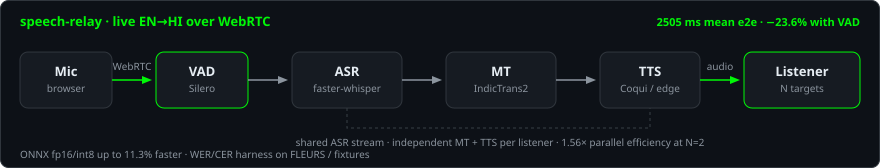

# Chitresh Yadav

**Backend & Applied ML Engineer** — streaming speech systems, measured latency, backends that actually run.

B.Tech — Computer Science and Business Systems, SSTC Bhilai · May 2026  
Open to **SDE-1 / Backend / Applied ML**.

I like work you can measure and ship. Streaming ASR → MT → TTS over WebRTC with hop-level latency. Queue-backed workers in Docker Compose. Flutter on the Play Store, not just in a repo.

Currently: LoRA fine-tuning Whisper for Hindi–English code-mixed ASR, then serving it from a Rust ONNX runtime.

---

## Featured — [speech-relay](https://github.com/csy20/speech-relay)

Real-time **speech-to-speech translation**. Live mic audio in, translated speech out, over WebRTC — not a wav-in / wav-out demo.

  

  

`faster-whisper` · IndicTrans2 / OPUS-MT · Coqui / edge-tts · aiortc · Silero-VAD · ONNX Runtime · asyncio

| Hop | mean | p50 | p95 |
|-----|------|-----|-----|
| ASR | 707 ms | 706 ms | 798 ms |
| MT | 579 ms | 570 ms | 766 ms |
| TTS | 1218 ms | 1203 ms | 1437 ms |
| **E2E** | **2505 ms** | **2580 ms** | **2934 ms** |

- Built a streaming ASR → MT → TTS service that returns live EN→HI audio over WebRTC, instrumented **per hop** (n = 11, CPU, `faster-whisper tiny/int8`).
- Replaced fixed-window flushing with **Silero-VAD** segmentation and tuned buffers — **23.6%** lower end-to-end latency versus the fixed-window path.
- One **shared ASR stream** fans out to N listeners with independent translation targets — **1.56×** parallel efficiency at 2 listeners (Hindi + Spanish).
- Quantized ASR/TTS with ONNX Runtime fp16/int8 (**up to 11.3%** faster) and added a **WER/CER + latency** eval harness.

**[code](https://github.com/csy20/speech-relay)** · **[eval numbers](https://github.com/csy20/speech-relay/blob/main/eval/results.md)** · **[demo notes](https://github.com/csy20/speech-relay/blob/main/DEMO.md)**

---

## Selected work

Same set as [csy20_resume.pdf](https://github.com/csy20/csy20/blob/main/csy20_resume.pdf).

**[speech-relay-rust](https://github.com/csy20/speech-relay-rust)** — Indic code-mixed ASR + Rust serving  
`Whisper` · LoRA / PEFT · PyTorch · ONNX · Rust (`ort`) · MUCS / OpenSLR-104

Data pipeline over MUCS Hindi–English speech (16 kHz resample, Devanagari + Latin filter, train/val/test). LoRA on Whisper decoder attention (`q/k/v/out`) so mid-utterance language switches stick. Serving path: merge LoRA → export encoder/decoder to ONNX → int8 → inference from a Rust `ort` service, outside Python.

**[MediaPipe AI](https://github.com/csy20/mediapipe-ai)** — distributed media pipeline  
`React` · Express · Python workers · Redis · PostgreSQL · MinIO · Docker Compose · Whisper · BART

Five-container system: React client → Express REST gateway → Redis job queue → Python workers (transcription + summarization) → PostgreSQL metadata + MinIO object storage. Async job polling, structured logging, S3-compatible uploads up to 500 MB so workers scale independently of the API.

**[router-agent](https://github.com/csy20/router-agent)** — token-efficient LLM router · AMD Hackathon ACT II  
`Python` · Docker · Ollama · Fireworks API · OpenTelemetry / SigNoz

Hybrid router that classifies tasks (math, NER, summarization, code, QA) with **zero-token** heuristics, then escalates to a local 1.5B LLM or at most **one** paid API call. Classify → local → API stages traced with OpenTelemetry into SigNoz; shipped as a Docker service with schema validation.

**[ByteWise](https://play.google.com/store/apps/details?id=com.csy20.bytewise)** — Flutter learning app · [Play Store](https://play.google.com/store/apps/details?id=com.csy20.bytewise)  
`Flutter` · Riverpod · GoRouter · Drift / SQLite · Google Sign-In · Material 3

Shipped to Google Play. 788+ lessons across DSA, system design, and six languages. Offline-first two-tier cache (in-memory + Drift) so startup I/O stays cheap.

Also shipping: **[contribute-pulse](https://csy20.me/contribute-pulse/)** — live board of OSS repos that will actually notice a PR · **[Nen](https://github.com/csy20/nen)** — Flutter music player with a real-time GLSL visualiser (Play Store closed testing).

---

## Stack

Speech / ML — faster-whisper (CTranslate2), Silero-VAD, IndicTrans2 / OPUS-MT, Coqui / edge-tts, LoRA / PEFT, ONNX quantization, WER/CER harnesses, LLM routing

Backend — FastAPI, Express, WebRTC (aiortc), asyncio, Redis queues, PostgreSQL, SQLite, MongoDB, MinIO / S3

Infra — Docker Compose, GitHub Actions, OpenTelemetry / SigNoz, GCP (Cloud Run, Cloud Storage, Firebase), Linux

Mobile — Flutter, Riverpod, Drift / SQLite, GLSL

---

  
  

---

**[csy20.me](https://csy20.me)** · **[resume (csy20_resume.pdf)](https://github.com/csy20/csy20/blob/main/csy20_resume.pdf)** · **[speech-relay](https://github.com/csy20/speech-relay)**

